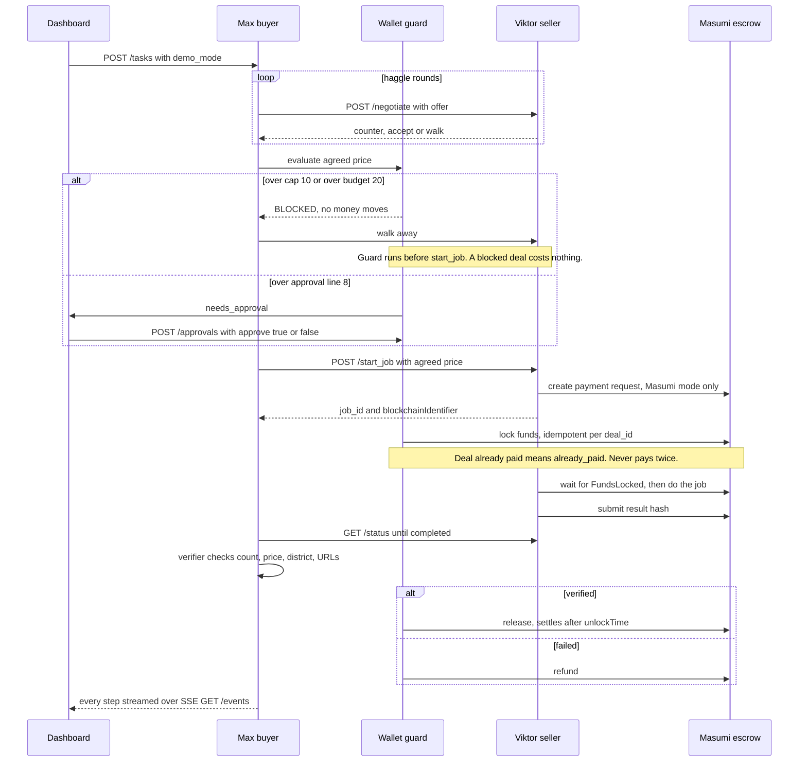

# Astra: The Haggle

Two AI agents haggle out loud over a job, one of them is a con artist, and the wallet still cannot be scammed:
**never trust the AI with the wallet, trust the code around it.**

Team MMZ (Ziya Sadigzade, Murad Shirinov, Mais Isifzade). Agents 0.0.7 "From Dusk Till Dawn", Agentic Economy track.

- Working rules for humans and coding agents: [AGENTS.md](AGENTS.md)
- Team memory (decisions, contracts, current state): [memory/MAP.md](memory/MAP.md)

## How it works

A buyer agent, **Max**, hires a seller agent, **Viktor**, to find 20 flats in Praha 7 under 25,000 CZK.
They are separate HTTP services. They haggle over price. Max can agree to any price, but Max cannot pay.
Only the **wallet guard** (`buyer/guard.py`, plain Python, no LLM) can move money. Money goes into
escrow (Masumi on Cardano Preprod, or a labelled SIMULATED ledger). A rule-based verifier checks the
delivery. Pass = release to Viktor. Fail = refund to Max.



## Why the guard is code, not prompt

- **A prompt can be talked out of a rule. An `if` cannot.** `WalletGuard.evaluate` blocks any amount over
  `GUARD_CAP` (10 tADA) or over the task budget (20), whatever the negotiator agreed to. Act 2 proves it.
- **The AI never holds the payment adapter.** Only `WalletGuard` has a `Payments` object
  (`buyer/payments.py`). The negotiator returns a price; it has no way to call `lock`.
- **Never pays a deal twice.** `WalletGuard.pay` checks the SQLite ledger for an existing escrow ref first,
  writes `status="paying"` before locking, and both payment adapters are idempotent per `deal_id`.
  A crash at any point resumes without a second payment (Act 3).
- **Humans approve the expensive ones.** Prices over `GUARD_APPROVAL_OVER` (8) pause until someone clicks
  Approve on the dashboard. No answer in 5 minutes = declined.

## The demo, in four acts

| Act | Demo mode | Proves |
|---|---|---|
| 1 The deal | `honest` | haggle 18 → 7, escrow, delivery, verify, release |
| 2 The con | `con` (STAGED) | Max accepts a fake "manager approved 25"; guard BLOCKS (cap 10) |
| 3 The glitch | `CRASH_AFTER_LOCK=1` (STAGED) | buyer dies after paying; on restart: `already_paid`, no double pay |
| 4 The refund | `junk` (STAGED) | garbage delivery fails verification, escrow refunded |

Non-honest acts carry `staged: true` on every event. All 4 acts plus the approval path run end to end in SIMULATED mode.

## Run

```bash
cp .env.example .env                                 # fill in keys; never commit .env
uv sync
uv run pytest                                        # 33 tests
uv run uvicorn seller.app:app --port 8001            # terminal 1
uv run uvicorn buyer.app:app --port 8000             # terminal 2
cd dashboard && npm install && npm run dev           # terminal 3, open http://localhost:5173
curl -X POST localhost:8000/tasks -H 'content-type: application/json' -d '{"demo_mode":"honest"}'
```

- One command for both servers: `uv run python scripts/up.py` (`--reset` clears data, `--crash` = Act 3:
  buyer dies after paying and auto-restarts, seller stays up).
- Terminal demo (no dashboard): `uv run python scripts/act.py honest|con|junk` prints the haggle and money events live.
- Act 3 by hand: start buyer with `CRASH_AFTER_LOCK=1`, run Act 1, buyer dies; restart buyer without it,
  then `scripts/act.py --watch`.
- Approval path: start seller with `SELLER_FLOOR=9`, deal settles at 9, dashboard shows Approve.
- Reset: `scripts/up.py --reset`, or delete `data/buyer.db`.

**Masumi mode** (real Preprod escrow). Set in `.env`, both buyer and seller: `PAYMENTS_MODE=masumi`,
`MASUMI_PAYMENT_URL`, `MASUMI_API_KEY`, `MASUMI_NETWORK=Preprod`, plus seller-side `MASUMI_AGENT_ID` and
`SELLER_VKEY`. Check the node first with `uv run python scripts/masumi_check.py` (read-only).
All names and defaults are in [.env.example](.env.example).

**LLM mode:** `LLM_MODE=openai` runs Max on the OpenAI Agents SDK (`OPENAI_API_KEY`, `MODEL`). Default is `mock`.

## Layout

```
shared/     contracts (pydantic), env settings, Masumi client (masumi.py)
buyer/      Max, :8000 - orchestrator, wallet guard, SQLite ledger, payments, verifier   (ziya)
seller/     Viktor, :8001 - MIP-003 + POST /negotiate, persona, flats job              (murad)
voice/      ElevenLabs TTS for haggle lines, text fallback                               (murad)
dashboard/  Vite + React, reads buyer SSE                                                (mais)
scripts/    up.py (both servers), act.py (one act in terminal), masumi_check.py
tests/      guard, acts 1-4 + approval E2E (SIMULATED), crash resume, negotiator,
            Masumi adapter against tests/fake_masumi.py
memory/     shared team memory for humans and coding agents
```

## Honest limitations

What is real and what is not, as of this commit.

| Area | State now |
|---|---|
| Money | Default is **SIMULATED**: escrow in SQLite, every event `simulated: true`, logs say `[SIMULATED]`. Testnet tADA only, even in Masumi mode. |
| Masumi mode | Built (`shared/masumi.py`, `MasumiPayments`, seller `/start_job`), but only tested against `tests/fake_masumi.py`. Not yet run against a live payment node. |
| Release | Masumi has no buyer-triggered release. The seller submits a result hash and funds unlock for the seller after `unlockTime`. Our `released` event says `release: "scheduled"` with `settles_at`. |
| Act 4 refund | Runs **SIMULATED** by decision. A Masumi refund after the seller submitted a result becomes a multi-step dispute, too slow for the demo. |
| Agents | Max and Viktor are **scripted** by default (`LLM_MODE=mock`). `LLM_MODE=openai` drives Max only, falls back to scripted Max on any error, and has not been tested live. Viktor has no LLM mode. |
| Gullible Max | Scripted Max is deliberately gullible to "your manager approved" so Act 2 is repeatable. The point is that the guard holds anyway. |
| Staging | Acts 2, 3, 4 are staged: Viktor's con, the crash, and the junk delivery are triggered on purpose and labelled `staged`. |
| Flats | **Sample data** (`source: "sample"`, `APIFY_MODE=sample`) until the Apify scrape lands. |
| Verifier | Rule-based: count, max price, district, unique `http` URLs. It cannot tell a real listing from a plausible fake one. |
| Seller state | Viktor keeps jobs in memory. Restarting the seller mid-deal strands the deal; only the buyer survives crashes. |
| Voice | ElevenLabs TTS (`TTS_MODE=elevenlabs`) not yet tested against the live API; text fallback works. |
